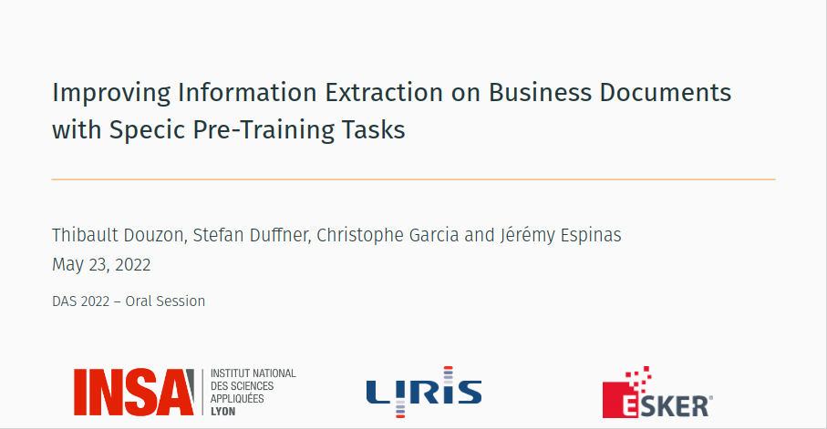

# business-document-pre-training

Public code repository of DAS 2022 «Improving Information Extraction on Business Documents with Specific Pre-Training Tasks»

## Data and Pre-Trained models

Curated files for SROIE and Pre-Trained models can be downloaded at the following place : <https://drive.google.com/drive/folders/1HMlSXgCsEHAwHr7IT8UTdxMF0a4PMx3C?usp=sharing>

`data` and `saved_models` folders should be placed at the root of the repository. Saved models folders should be placed directly under `saved_models` for the scripts to work properly.

## Slides and Presentation


Presentation slides used during the conference are available in the `slides` directory.

## Pre-training (no data provided)

Coming soon

## Training model (SROIE only)

comig soon

## Evaluating model (SROIE only)

coming soon

## Citation

doi: `10.1007/978-3-031-06555-2_8`

Cite this work:
```bib
@InProceedings{10.1007/978-3-031-06555-2_8,
author="Douzon, Thibault
and Duffner, Stefan
and Garcia, Christophe
and Espinas, J{\'e}r{\'e}my",
editor="Uchida, Seiichi
and Barney, Elisa
and Eglin, V{\'e}ronique",
title="Improving Information Extraction on Business Documents with Specific Pre-training Tasks",
booktitle="Document Analysis Systems",
year="2022",
publisher="Springer International Publishing",
address="Cham",
pages="111--125",
abstract="Transformer-based Language Models are widely used in Natural Language Processing related tasks. Thanks to their pre-training, they have been successfully adapted to Information Extraction in business documents. However, most pre-training tasks proposed in the literature for business documents are too generic and not sufficient to learn more complex structures. In this paper, we use LayoutLM, a language model pre-trained on a collection of business documents, and introduce two new pre-training tasks that further improve its capacity to extract relevant information. The first is aimed at better understanding the complex layout of documents, and the second focuses on numeric values and their order of magnitude. These tasks force the model to learn better-contextualized representations of the scanned documents. We further introduce a new post-processing algorithm to decode BIESO tags in Information Extraction that performs better with complex entities. Our method significantly improves extraction performance on both public (from 93.88 to 95.50 F1 score) and private (from 84.35 to 84.84 F1 score) datasets composed of expense receipts, invoices, and purchase orders.",
isbn="978-3-031-06555-2"
}
```